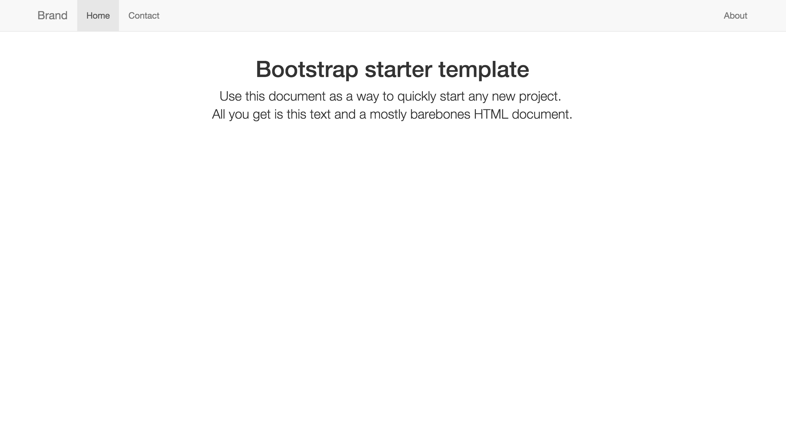

# generator-sinatra-bootstrap
Yeoman generator for a sinatra with twitter bootstrap.

Sinatra-Bootstrap generator helps you to start with a sinatra ready application which has support for Compass, Sass, Haml, Rspec and debugger tools to prototype easily.

Also has optional support for for background jobs with sidekiq, database connection with postgres and active record, it is heroku ready and API support with grape.



Helps you to scaffold you sinatra app in one command.

## Getting Started

```
$ npm install -g yo
```

To install generator-sinatra-bootstrap from npm, run:

```
$ npm install -g generator-sinatra-bootstrap
```

Initiate the generator:

```
$ yo sinatra-bootstrap
```

Finally, install npm and bower dependencies:
```
npm install && bower install && bundle install
```
